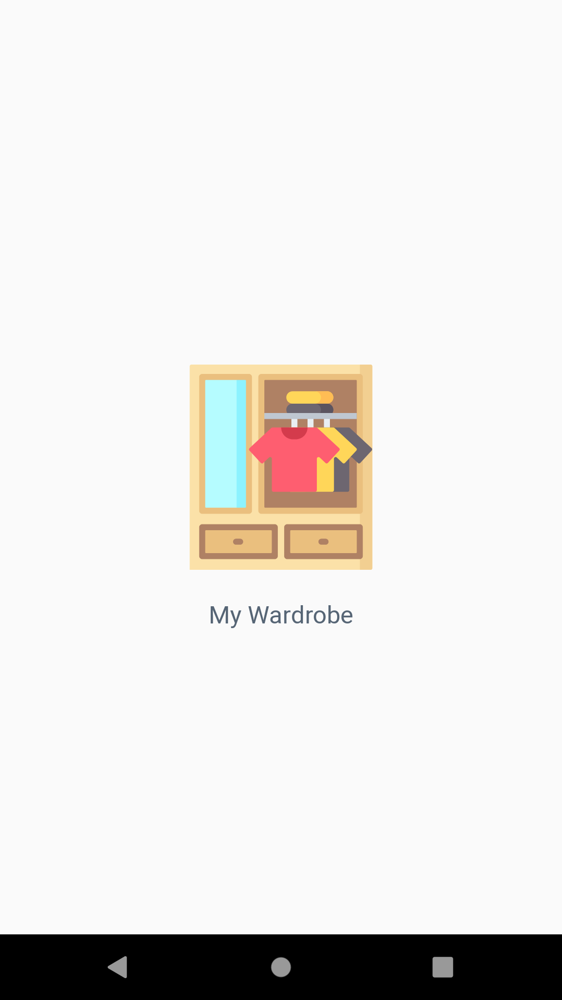
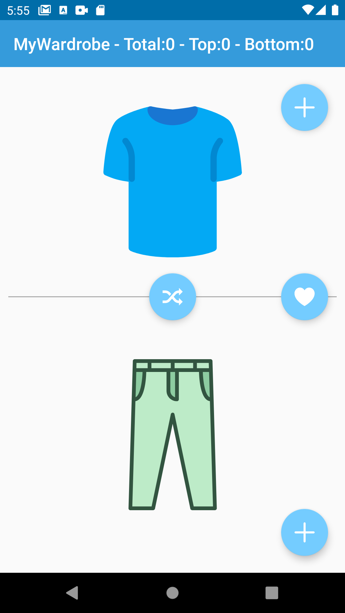
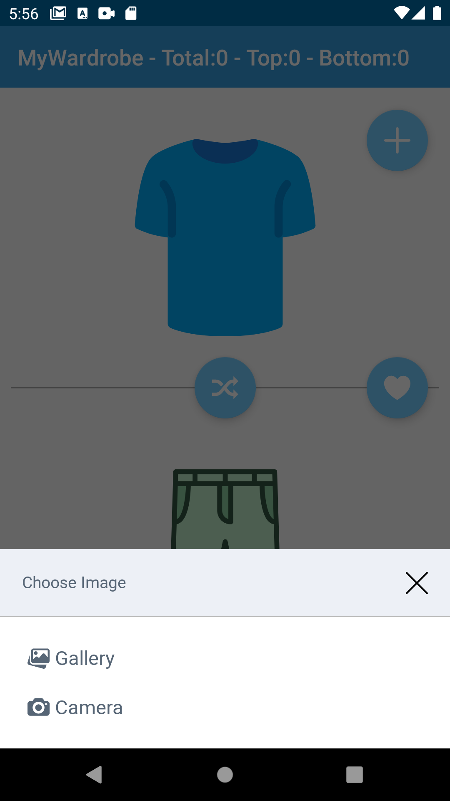
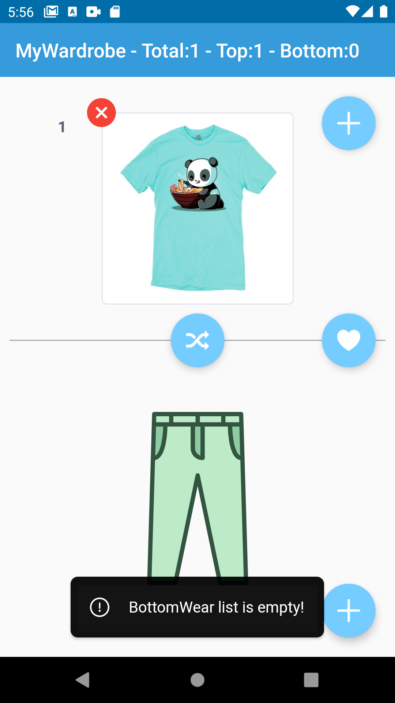
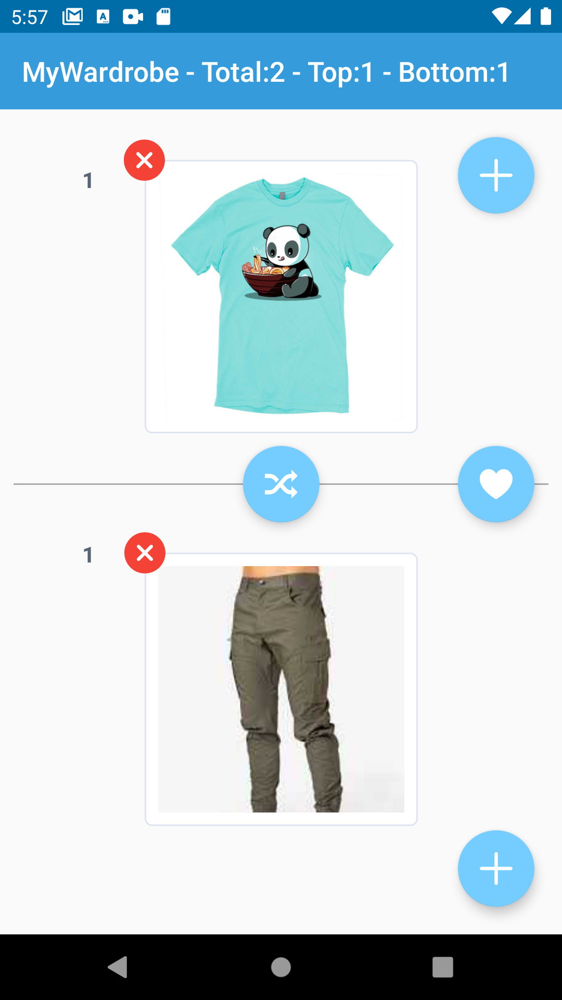
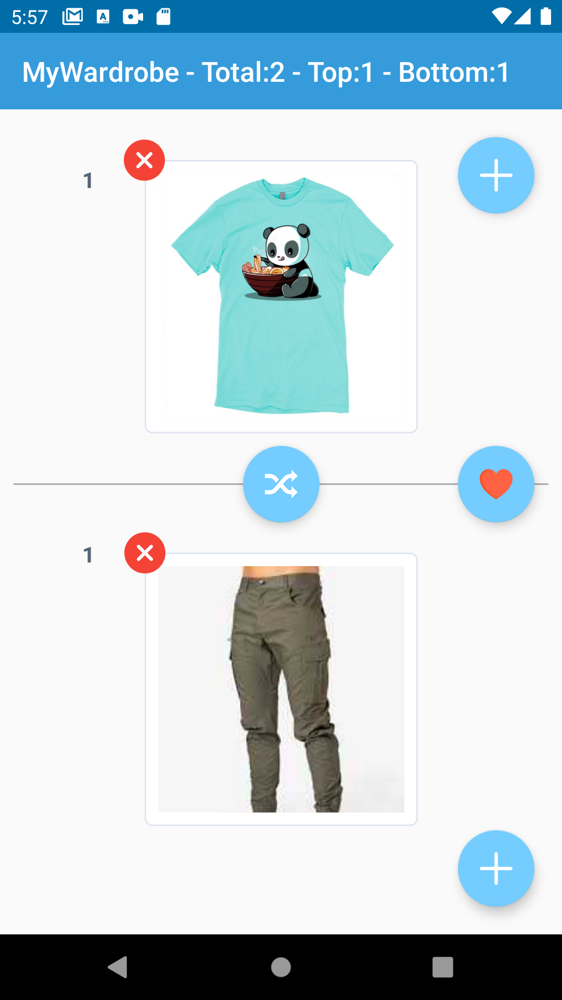
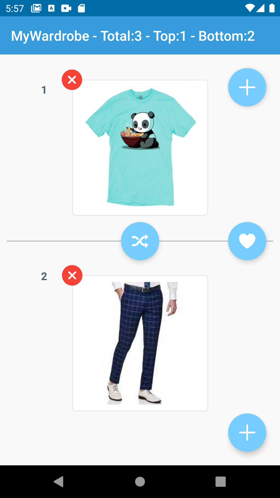

# MyWardrobe

My Wardrobe is a sample demonstation of MVVM with Room where user can click or pick image of top/bottom from gallery and save the image in the database, User can then shuffle and favourite their collection.

#### Screenshot

